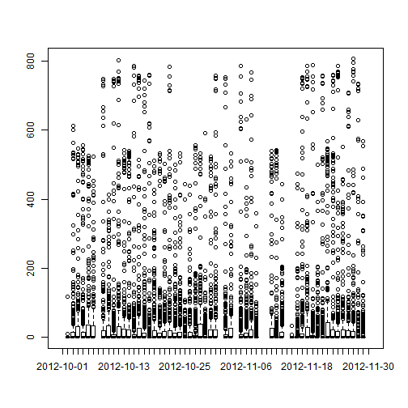
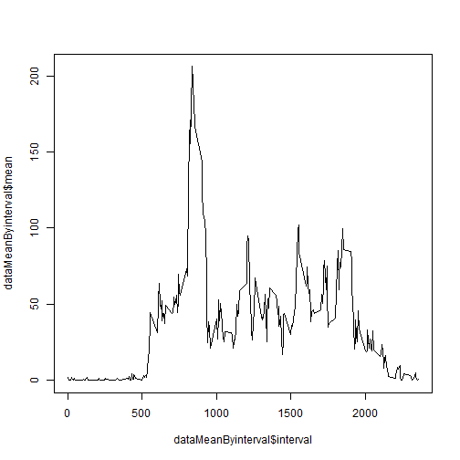
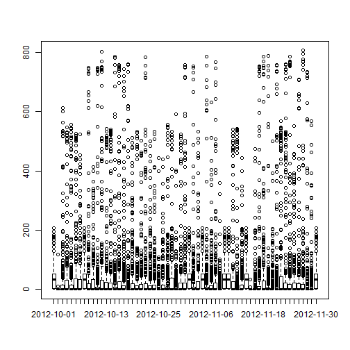
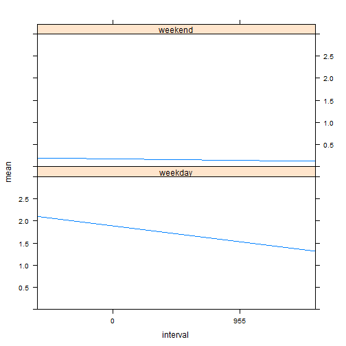

# Reproducible Research: Peer Assessment 1

The steps to start coding are:  

1. Fork project to your local machine  
2. Open RSTUDIO (with R version 3.1.1 configured)  
3. Open PA1_template.Rmd file and code  

## Loading and preprocessing the data

Then steps to load and preprocess the data are:  

1. Set your working directory to the location you downloaded the project files  
2. Unzip activity.zip file  
3. Read activity.csv file  

The code that performs activities 1 2 and 3 is as follows:  


```r
projectWorkingDirectory <- "D:/Data/personal/Cursos/05 Reproducible Research/RepData_PeerAssessment1"
setwd(projectWorkingDirectory)
unzip("activity.zip")
rawData<-read.csv("activity.csv")
noNaData<-rawData[!is.na(rawData$steps),]
noNaData$dateformated<-factor(format(as.Date(noNaData$date),"%C%y-%m-%d %a"))
NaData<-rawData[is.na(rawData$steps),]
```

## What is mean total number of steps taken per day?

1. Make a histogram of the total number of steps taken each day  


```r
plot(rawData$date,rawData$steps,type="h")
```

 

2. Calculate and report the **mean** and **median** total number of steps taken per day  


```r
#This does not work. I do not know why
#library("plyr", lib.loc="d:/Program Files/R/R-3.1.1/library")
#dataSummary<-ddply(noNaData,.(dateformated),summarise
#                ,dailymean=mean(noNaData$steps),dailymedian=median(noNaData$steps))
#print(dataSummary)

#This works
dataMean<-as.data.frame(with(noNaData,tapply(steps,dateformated,mean,na.rm=T)))
dataMean$date<-row.names(dataMean)
colnames(dataMean)<-c("mean","date")
dataMedian<-as.data.frame(with(noNaData,tapply(steps,dateformated,median,na.rm=T)))
dataMedian$date<-row.names(dataMedian)
colnames(dataMedian)=c("meadian","date")
dataSummary<-merge(dataMean,dataMedian,by.x="date",by.y="date")
print(dataSummary)
```

```
##              date    mean meadian
## 1  2012-10-02 mar  0.4375       0
## 2  2012-10-03 mié 39.4167       0
## 3  2012-10-04 jue 42.0694       0
## 4  2012-10-05 vie 46.1597       0
## 5  2012-10-06 sáb 53.5417       0
## 6  2012-10-07 dom 38.2465       0
## 7  2012-10-09 mar 44.4826       0
## 8  2012-10-10 mié 34.3750       0
## 9  2012-10-11 jue 35.7778       0
## 10 2012-10-12 vie 60.3542       0
## 11 2012-10-13 sáb 43.1458       0
## 12 2012-10-14 dom 52.4236       0
## 13 2012-10-15 lun 35.2049       0
## 14 2012-10-16 mar 52.3750       0
## 15 2012-10-17 mié 46.7083       0
## 16 2012-10-18 jue 34.9167       0
## 17 2012-10-19 vie 41.0729       0
## 18 2012-10-20 sáb 36.0938       0
## 19 2012-10-21 dom 30.6285       0
## 20 2012-10-22 lun 46.7361       0
## 21 2012-10-23 mar 30.9653       0
## 22 2012-10-24 mié 29.0104       0
## 23 2012-10-25 jue  8.6528       0
## 24 2012-10-26 vie 23.5347       0
## 25 2012-10-27 sáb 35.1354       0
## 26 2012-10-28 dom 39.7847       0
## 27 2012-10-29 lun 17.4236       0
## 28 2012-10-30 mar 34.0938       0
## 29 2012-10-31 mié 53.5208       0
## 30 2012-11-02 vie 36.8056       0
## 31 2012-11-03 sáb 36.7049       0
## 32 2012-11-05 lun 36.2465       0
## 33 2012-11-06 mar 28.9375       0
## 34 2012-11-07 mié 44.7326       0
## 35 2012-11-08 jue 11.1771       0
## 36 2012-11-11 dom 43.7778       0
## 37 2012-11-12 lun 37.3785       0
## 38 2012-11-13 mar 25.4722       0
## 39 2012-11-15 jue  0.1424       0
## 40 2012-11-16 vie 18.8924       0
## 41 2012-11-17 sáb 49.7882       0
## 42 2012-11-18 dom 52.4653       0
## 43 2012-11-19 lun 30.6979       0
## 44 2012-11-20 mar 15.5278       0
## 45 2012-11-21 mié 44.3993       0
## 46 2012-11-22 jue 70.9271       0
## 47 2012-11-23 vie 73.5903       0
## 48 2012-11-24 sáb 50.2708       0
## 49 2012-11-25 dom 41.0903       0
## 50 2012-11-26 lun 38.7569       0
## 51 2012-11-27 mar 47.3819       0
## 52 2012-11-28 mié 35.3576       0
## 53 2012-11-29 jue 24.4688       0
```


## What is the average daily activity pattern?

1. Make a time series plot (i.e. type = "l") of the 5-minute interval (x-axis)
and the average number of steps taken, averaged across all days (y-axis)  


```r
dataMeanByinterval<-as.data.frame(with(noNaData,tapply(steps,interval,mean,na.rm=T)))
dataMeanByinterval$interval<-row.names(dataMeanByinterval)
colnames(dataMeanByinterval)<-c("mean","interval")
plot(dataMeanByinterval$interval,dataMeanByinterval$mean,type="l")
```

 


2. Which 5-minute interval, on average across all the days in the dataset,
contains the maximum number of steps?  

In order to obtain the result, we sort (decreasing) the vector of means and get the first value  
Interval 835 has the greater average mean across all days  


```r
dataMaxMeanByinterval<-with(noNaData,tapply(steps,interval,mean,na.rm=T))
dataMaxMeanByinterval<-sort(dataMaxMeanByinterval,decreasing=TRUE)
print(dataMaxMeanByinterval[1])
```

```
##   835 
## 206.2
```


## Imputing missing values

    

1. Calculate and report the total number of missing values in the dataset (i.e. the total number of rows with NAs)  


```r
colSums(is.na(rawData))
```

```
##    steps     date interval 
##     2304        0        0
```

2. Devise a strategy for filling in all of the missing values in the dataset. The strategy does not need to be sophisticated. For example, you could use the mean/median for that day, or the mean for that 5-minute interval, etc.  

We will use the second strategy suggested.

2.1 Extract the data with NAs in a different dataframe.  
2.2 Merge with Mean By Interval dataframe.  
2.3 Bind rows of data with NAs (replaced with mean by interval) and without NAs.  

3. Create a new dataset that is equal to the original dataset but with the missing data filled in.  


```r
NaData<-rawData[is.na(rawData$steps),]
dataFill<-merge(NaData,dataMeanByinterval,by.x="interval",by.y="interval")
dataFillNa<-dataFill[,c("mean","date","interval")]
#dataFillNa$row.names<-NA
dataFillNa<-dataFillNa[,c("mean","date","interval")]
colnames(dataFillNa)<-c("steps","date","interval")
dataFillNa$dateformated<-factor(format(as.Date(dataFillNa$date),"%C%y-%m-%d %a"))
dataComplete<-rbind(noNaData,dataFillNa)
```

4. Make a histogram of the total number of steps taken each day and Calculate and report the mean and median total number of steps taken per day. Do these values differ from the estimates from the first part of the assignment? What is the impact of imputing missing data on the estimates of the total daily number of steps?  


```r
plot(dataComplete$date,dataComplete$steps,type="h")
```

 

```r
dataMeanComplete<-as.data.frame(with(dataComplete,tapply(steps,dateformated,mean,na.rm=T)))
dataMeanComplete$date<-row.names(dataMeanComplete)
colnames(dataMeanComplete)<-c("mean","date")
dataMedianComplete<-as.data.frame(with(dataComplete,tapply(steps,dateformated,median,na.rm=T)))
dataMedianComplete$date<-row.names(dataMedianComplete)
colnames(dataMedianComplete)=c("meadian","date")
dataSummaryComplete<-merge(dataMeanComplete,dataMedianComplete,by.x="date",by.y="date")
print(dataSummaryComplete)
```

```
##              date    mean meadian
## 1  2012-10-01 lun 37.3826   34.11
## 2  2012-10-02 mar  0.4375    0.00
## 3  2012-10-03 mié 39.4167    0.00
## 4  2012-10-04 jue 42.0694    0.00
## 5  2012-10-05 vie 46.1597    0.00
## 6  2012-10-06 sáb 53.5417    0.00
## 7  2012-10-07 dom 38.2465    0.00
## 8  2012-10-08 lun 37.3826   34.11
## 9  2012-10-09 mar 44.4826    0.00
## 10 2012-10-10 mié 34.3750    0.00
## 11 2012-10-11 jue 35.7778    0.00
## 12 2012-10-12 vie 60.3542    0.00
## 13 2012-10-13 sáb 43.1458    0.00
## 14 2012-10-14 dom 52.4236    0.00
## 15 2012-10-15 lun 35.2049    0.00
## 16 2012-10-16 mar 52.3750    0.00
## 17 2012-10-17 mié 46.7083    0.00
## 18 2012-10-18 jue 34.9167    0.00
## 19 2012-10-19 vie 41.0729    0.00
## 20 2012-10-20 sáb 36.0938    0.00
## 21 2012-10-21 dom 30.6285    0.00
## 22 2012-10-22 lun 46.7361    0.00
## 23 2012-10-23 mar 30.9653    0.00
## 24 2012-10-24 mié 29.0104    0.00
## 25 2012-10-25 jue  8.6528    0.00
## 26 2012-10-26 vie 23.5347    0.00
## 27 2012-10-27 sáb 35.1354    0.00
## 28 2012-10-28 dom 39.7847    0.00
## 29 2012-10-29 lun 17.4236    0.00
## 30 2012-10-30 mar 34.0938    0.00
## 31 2012-10-31 mié 53.5208    0.00
## 32 2012-11-01 jue 37.3826   34.11
## 33 2012-11-02 vie 36.8056    0.00
## 34 2012-11-03 sáb 36.7049    0.00
## 35 2012-11-04 dom 37.3826   34.11
## 36 2012-11-05 lun 36.2465    0.00
## 37 2012-11-06 mar 28.9375    0.00
## 38 2012-11-07 mié 44.7326    0.00
## 39 2012-11-08 jue 11.1771    0.00
## 40 2012-11-09 vie 37.3826   34.11
## 41 2012-11-10 sáb 37.3826   34.11
## 42 2012-11-11 dom 43.7778    0.00
## 43 2012-11-12 lun 37.3785    0.00
## 44 2012-11-13 mar 25.4722    0.00
## 45 2012-11-14 mié 37.3826   34.11
## 46 2012-11-15 jue  0.1424    0.00
## 47 2012-11-16 vie 18.8924    0.00
## 48 2012-11-17 sáb 49.7882    0.00
## 49 2012-11-18 dom 52.4653    0.00
## 50 2012-11-19 lun 30.6979    0.00
## 51 2012-11-20 mar 15.5278    0.00
## 52 2012-11-21 mié 44.3993    0.00
## 53 2012-11-22 jue 70.9271    0.00
## 54 2012-11-23 vie 73.5903    0.00
## 55 2012-11-24 sáb 50.2708    0.00
## 56 2012-11-25 dom 41.0903    0.00
## 57 2012-11-26 lun 38.7569    0.00
## 58 2012-11-27 mar 47.3819    0.00
## 59 2012-11-28 mié 35.3576    0.00
## 60 2012-11-29 jue 24.4688    0.00
## 61 2012-11-30 vie 37.3826   34.11
```

Therese in much impact as we can see comparing medias. Median of certain days change because there 
was no data instead of 0 steps like most of the days.


## Are there differences in activity patterns between weekdays and weekends?


For this part the weekdays() function may be of some help here. Use the dataset with the filled-in missing values for this part.  

1. Create a new factor variable in the dataset with two levels -- "weekday" and "weekend" indicating whether a given date is a weekday or weekend day.  


```r
dataComplete$weekdayfactor<-factor(ifelse(weekdays(as.Date(dataComplete$date)) %in% c("sábado","domingo"),"weekend","weekday"))
```

2. Make a panel plot containing a time series plot (i.e. type = "l") of the 5-minute interval (x-axis) and the average number of steps taken, averaged across all weekday days or weekend days (y-axis). The plot should look something like the following, which was creating using simulated data:  


```r
dataCompleteweekday<-dataComplete[dataComplete$weekdayfactor=="weekday",]
dataCompleteweekend<-dataComplete[dataComplete$weekdayfactor=="weekend",]


dataCompleteMeanByintervalWday<-as.data.frame(with(dataCompleteweekday
                                                   ,tapply(steps,interval,mean,na.rm=T)))
dataCompleteMeanByintervalWday$interval<-row.names(dataCompleteMeanByintervalWday)
colnames(dataCompleteMeanByintervalWday)<-c("mean","interval")
dataCompleteMeanByintervalWday$weekdayfactor<-"weekday"


dataCompleteMeanByintervalWend<-as.data.frame(with(dataCompleteweekend
                                                   ,tapply(steps,interval,mean,na.rm=T)))
dataCompleteMeanByintervalWend$interval<-row.names(dataCompleteMeanByintervalWend)
colnames(dataCompleteMeanByintervalWend)<-c("mean","interval")
dataCompleteMeanByintervalWend$weekdayfactor<-"weekend"

dataFinalGraph <- rbind(dataCompleteMeanByintervalWday,dataCompleteMeanByintervalWend)
dataFinalGraph$weekdayfactor <- factor(dataFinalGraph$weekdayfactor)


library("lattice", lib.loc="d:/Program Files/R/R-3.1.1/library")
xyplot(mean ~ interval | weekdayfactor,data=dataFinalGraph,layout=c(1,2),type="l",ylim=c(0,3))
```

 


On average, the person walks less steps per 5 sec on weekends.


